Spring Boot 댓글 기능 기반 REST API
-------------------------------------------------------------------------------------------------------------

📝 프로젝트 개요
해당 프로젝트는 일정(Schedule)에 대한 댓글 및 대댓글 기능을 제공하는 Spring Boot 기반의 백엔드 API 입니다.
로그인 후 특정 일정에 대해 댓글을 작성하거나, 댓글에 대한 대댓글까지 작성할 수 있지만, 대댓글에는 추가 대댓글 작성이 불가능하도록 했습니다
댓글 조회, 수정, 삭제 기능도 포함되어 있습니다.
-------------------------------------------------------------------------------------------------------------

🎯 핵심 기능
✅ 회원가입 & 로그인 (JWT 기반 인증)
✅ 일정(Schedule)에 대한 댓글 등록
✅ 대댓글(1-depth) 등록
✅ 댓글/대댓글 목록 조회 (일정 기준)
✅ 댓글 수정 및 삭제
❌ 대댓글의 대댓글은 제한됨 (1-depth 제한)
-------------------------------------------------------------------------------------------------------------

📮 API 명세 요약

👤 사용자 API

- POST /api/user/signup – 회원가입 (요청: email, password, nickname, userRole)

- POST /api/user/login – 로그인 및 JWT 발급 (요청: email, password)

- GET /api/user/{id} – 사용자 정보 조회 (인증 필요)

📆 일정 API

- POST /api/schedule – 일정 생성 (요청: title, content, 인증 필요)

- GET /api/schedule/{id} – 일정 단건 조회 (인증 필요)

- GET /api/schedule – 전체 일정 목록 조회 (인증 필요)

- PUT /api/schedule/{id} – 일정 수정 (요청: title, content, 인증 필요)

- DELETE /api/schedule/{id} – 일정 삭제 (인증 필요)

💬 댓글 API

- POST /api/schedule/{scheduleId}/comment
→ 댓글 등록 (요청: content, parentId는 선택 / 인증 필요)

- GET /api/schedule/{scheduleId}/comment
→ 댓글 및 대댓글 목록 조회 (인증 필요)

- PUT /api/comment/{commentId}
→ 댓글 수정 (요청: content / 인증 필요)

- DELETE /api/comment/{commentId}
→ 댓글 삭제 (인증 필요)

⚠️ 예외 처리

- GlobalExceptionHandler에서 통합 처리

- ErrorCode enum 기반으로 도메인별 에러코드 관리

- 일관된 에러 응답 형식 사용:
- {
  "code": "COMMENT-001",
  "message": "댓글이 존재하지 않습니다.",
  "status": 404
  }
기능 테스트 사진

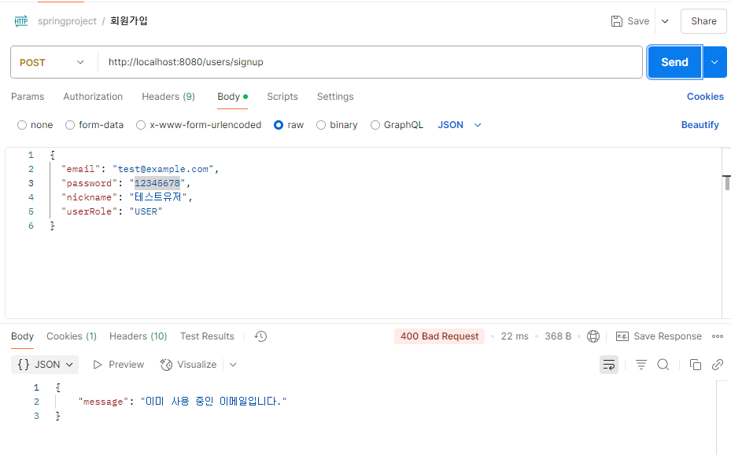
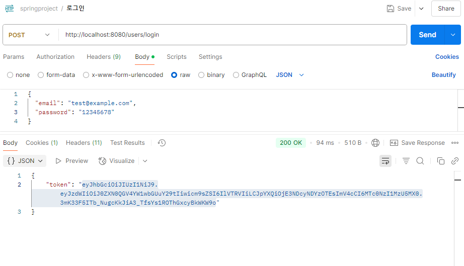
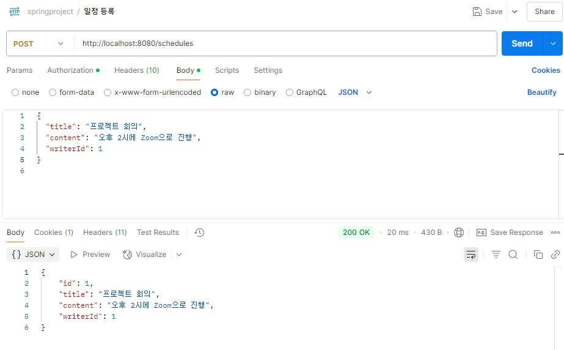
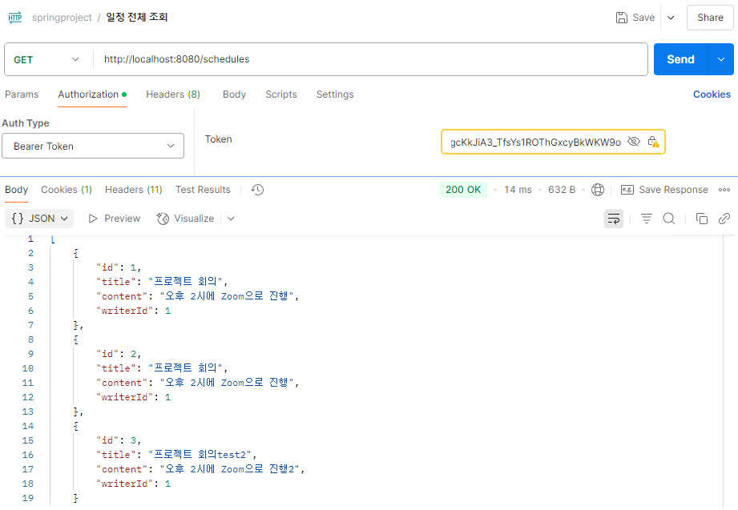

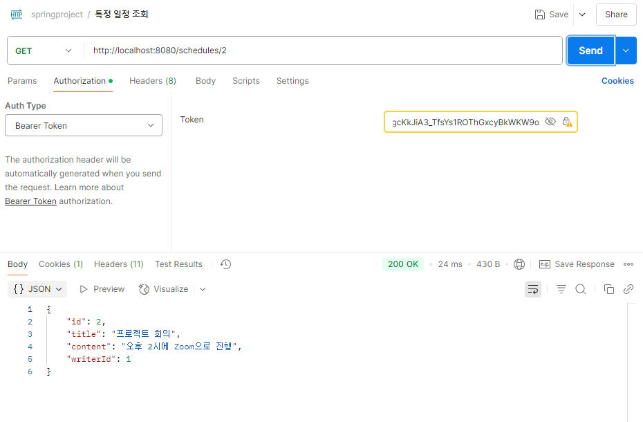
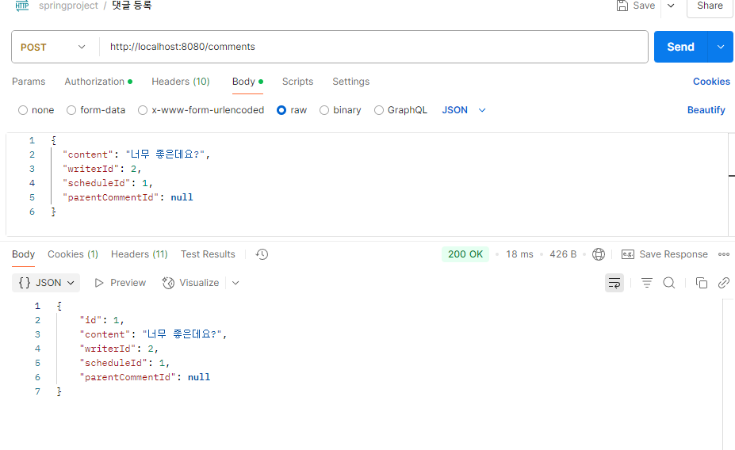
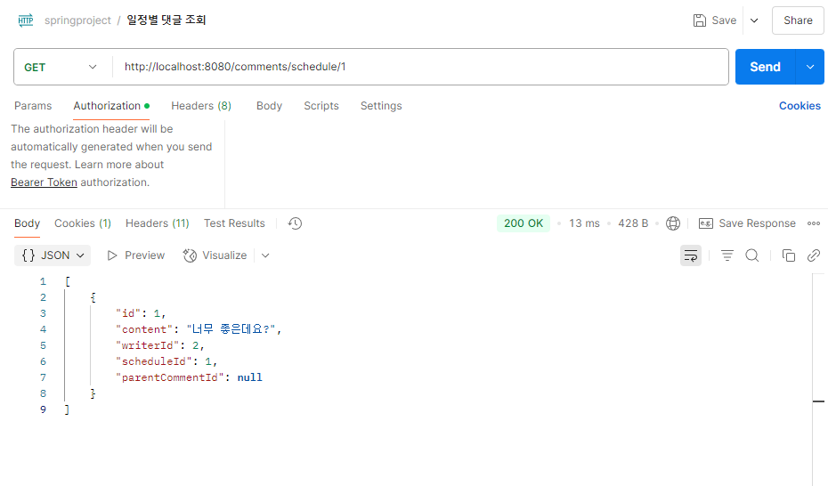
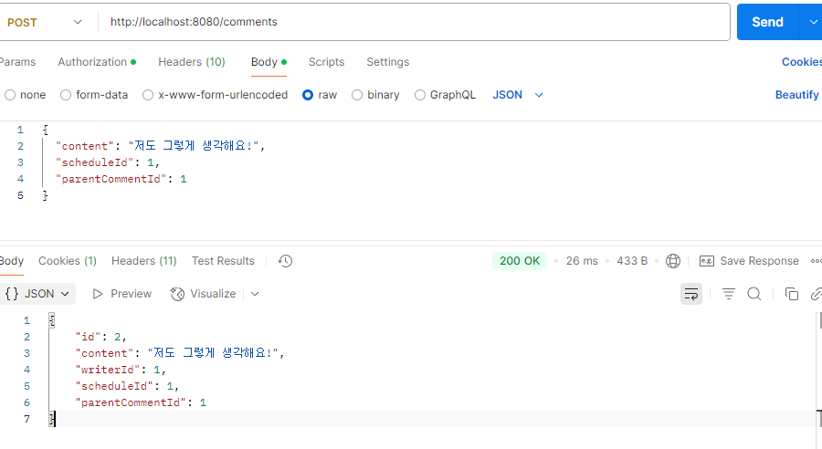

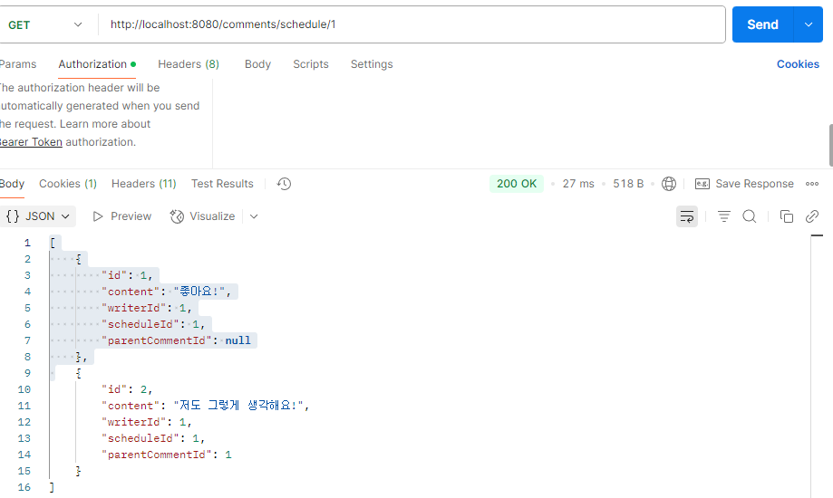
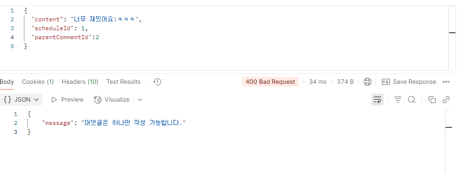
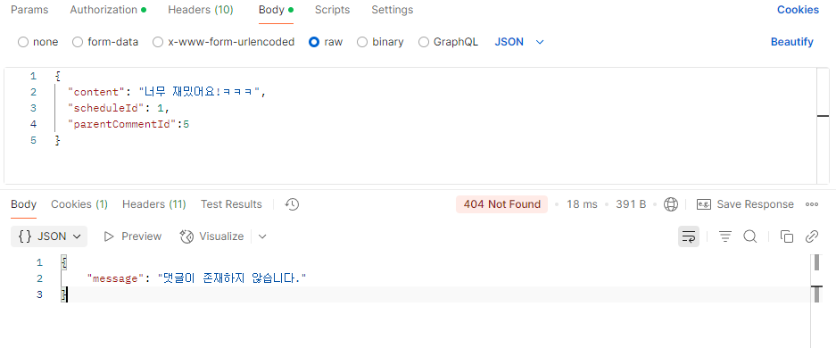

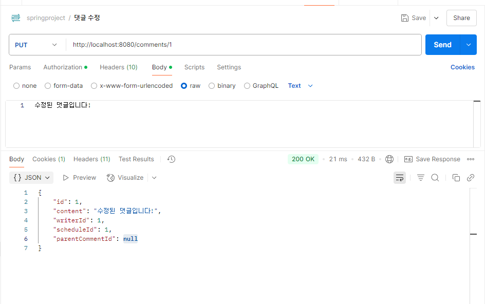
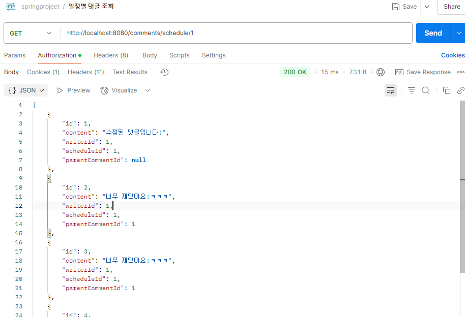
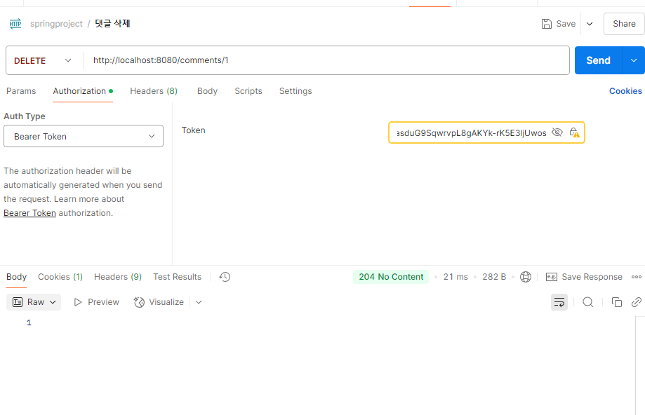
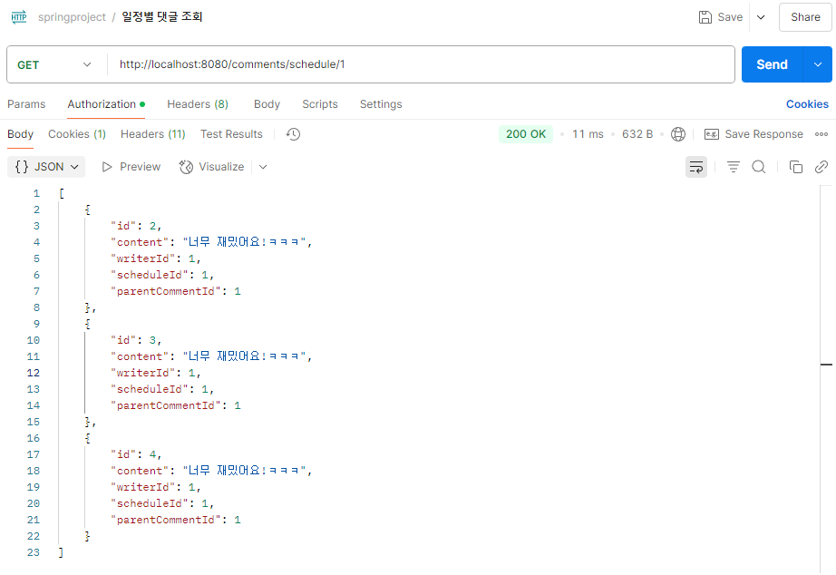
